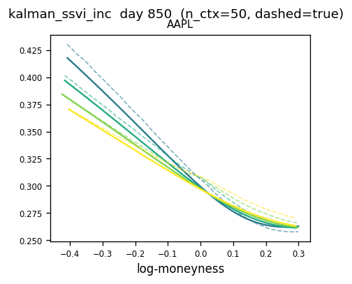
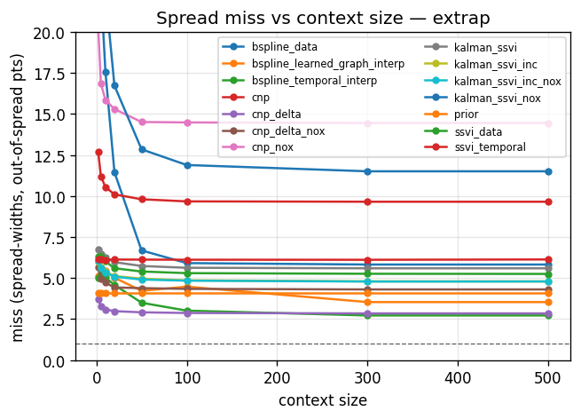
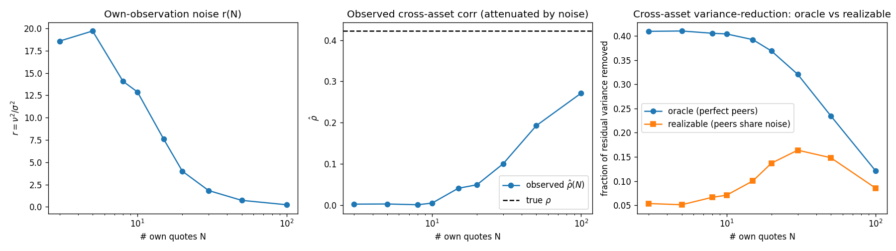
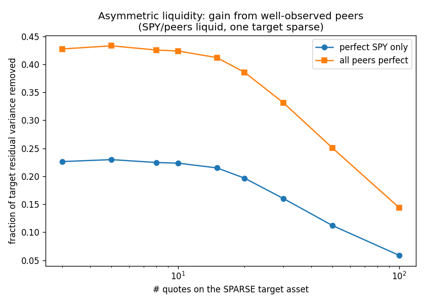

# surfacelab

Predicting a full implied volatility surface from very few quotes, and testing honestly
whether the usual tricks (temporal persistence, cross-asset structure, neural methods)
actually help. Short answer: under scarcity, structure beats flexibility, yesterday's surface
is the thing to beat, and coupling assets together adds essentially nothing once a market
factor is accounted for.

This is the code behind my MSc dissertation. Everything from a per-day SVI fit to a
Conditional Neural Process implements one interface, so a single evaluation harness compares
them all on the same days, the same context samples and the same metrics.

## The problem

An options desk quotes a handful of liquid points per name each morning: near the money,
short dated. Everything else on the surface (wide strikes, long maturities) is filled in
by hand, by eye. The question is whether that can be done systematically, and what
information is actually useful for doing it.

Formally: given yesterday's fitted surface per asset plus `n` of today's quotes, predict
today's surface everywhere, including the region no quote was given for. Two sources of
information are available beyond today's quotes:

1. **Time.** The surface barely moves day to day, so yesterday is a strong starting point.
2. **Cross-asset.** ATM increments across the eight assets are correlated (mean pairwise
   correlation about 0.42), so a well quoted peer might tell you something about a sparse
   name.

Most of the work went into finding out how much each is worth, and the answers came out less
flattering than I expected: time is worth a lot, cross-asset is worth close to nothing. Most
of that 0.42 is just the whole market moving together, and a single quote on the name already
reveals that. Once SPY is regressed out, the correlation left between two names is about
0.27, and point for point in the wings, where the quotes are actually missing, it is about
0.16.

## What is in here

Everything is a `SurfaceModel` with the same contract:

```python
class SurfaceModel:
    def train(self, data, *, saved=False, force=False) -> None: ...     # optional
    def predict(self, context: Quotes, query: QueryPoints) -> SurfacePrediction: ...
    # sequential hooks, default to a stateless model:
    def reset_sequence(self): ...
    def seed_prior(self, quotes: Quotes): ...
    def step(self, context, query) -> SurfacePrediction: ...
```

The methods:

| Family | Models |
|---|---|
| Per-day fits | SVI, SVI jump-wing, SSVI, B-spline smiles, PCA |
| Regularised fits | the same bases with temporal, cross-maturity and cross-asset graph penalties |
| State space | Kalman filter over SSVI parameters, PCA factors or B-spline coefficients, on levels or increments |
| Neural | Conditional Neural Process, absolute and increment (delta) form, with and without cross-asset attention |
| Baseline | persistence, carry yesterday's fitted surface forward unchanged |

The regularised B-spline is the piece I like most: the joint data plus temporal plus
cross-asset objective is quadratic in the coefficients, so the whole multi-asset,
multi-maturity fit is one sparse block linear system rather than an iterative optimisation.
See `surfacelab/models/regularized.py`.

Two evaluation modes, both in `surfacelab/eval/harness.py`:

- **independent**: every eval day is re-seeded with yesterday's full quotes, so the prior is
  accurate and you are measuring pure inference skill. Sweeps context size and adds an
  extrapolation split where only the liquid region is observed.
- **sequential**: seed once on day 0, then walk forward 100 days where tomorrow's prior is
  the model's own fit today. Error compounds, and this is where most methods fall apart.

## Metrics

RMSE in vol points is reported, but the metric that matters is whether the predicted price
lands inside the bid-ask spread. A prediction that is 1 vol point off is fine on a wide
illiquid put and useless on a tight ATM call. So each predicted IV is converted to a
normalised option price (respecting the option type, since the surface is OTM: puts below
the money, calls above) and compared against the observed spread. Two numbers come out:
the percentage of points outside the spread, and for those, how far outside in spread
widths. Details in `surfacelab/eval/metrics.py`.

## Results

Real market data: seven US tech names plus SPY, the last 900 trading days of a Polygon
end-of-day chain, first 800 for training and last 100 for evaluation. Numbers below are the
extrapolation split with 20 context quotes per asset, so the model sees only liquid quotes
and is scored on the illiquid region.

**With an accurate prior** (independent mode, `thesis_perfect_prior`):

| Model | RMSE (vol pts) | % outside spread | Miss (spread widths) |
|---|---|---|---|
| delta CNP, cross-asset | 2.22 | 70.2 | 2.98 |
| delta CNP, single asset | 2.35 | 76.1 | 4.43 |
| persistence baseline | 2.77 | 76.3 | 4.07 |
| B-spline, learned graph | 3.58 | 77.7 | 5.03 |
| B-spline, temporal | 2.85 | 78.6 | 4.58 |
| SSVI, temporal | 4.27 | 84.2 | 6.13 |
| Kalman on SSVI increments | 4.29 | 84.6 | 5.13 |
| B-spline, data only | 6.80 | 85.4 | 11.45 |
| absolute CNP | 4.23 | 92.1 | 10.10 |

The CNP rows come with a caveat these three columns do not show: the network breaks butterfly
no-arbitrage on about one point in six (the structured fits are at or near zero), so a surface
it produces cannot be quoted as it stands. Read the neural numbers as an upper bound on what
flexibility buys, not as a usable model.

**Free running** (sequential mode, `thesis_sequential`): each model carries its own fit
forward for 100 days, so error compounds. The persistence baseline is re-seeded with the
true previous day at every step, which is what makes it the bar to beat rather than just
another free-running model.

Note that this is not an apples-to-apples comparison, and deliberately so: persistence sees
strictly more data than the free-running models. It is re-fitted every step on the *full*
previous-day surface (every available quote, `yesterday=Full()` plus `reseed_each_step`),
whereas the other models see the true surface only once to seed day 0 and from then on get
20 quotes per asset per day and their own carried fit. So persistence is not a competitor
here, it is an upper reference: the score a model would need to match while working from a
small fraction of the information.

| Model | RMSE (vol pts) | % outside spread | Miss (spread widths) |
|---|---|---|---|
| persistence baseline | 2.77 | 76.3 | 4.07 |
| B-spline, data only | 6.71 | 85.0 | 11.82 |
| Kalman on SSVI increments | 4.13 | 87.8 | 5.79 |
| SSVI, data only | 4.55 | 88.7 | 6.56 |
| absolute CNP | 4.21 | 91.9 | 9.98 |

The delta CNP is absent here on purpose: left to carry its own prior forward, the prior it
subtracts drifts away from the accurate fit it was trained against and the error grows by a
few hundredths of a vol point a day until it is several vol points out. It is only run in the
re-anchored setting above. The absolute CNP, which carries nothing forward, is the neural
model that free-runs.

### What that says

**Representation beats dynamics.** Which basis you fit matters far more than what dynamics
you put on top of it. Anything unconstrained enough to bend into the wings (a raw B-spline
fit on 20 quotes) produces prices 11 spread widths away, and no amount of temporal
smoothing rescues it. Structured bases (SSVI, or a B-spline with a temporal penalty) stay
within a few spread widths on the same data.

**Persistence is very hard to beat.** In free-running mode nothing beats simply carrying
yesterday's surface forward, though as noted above persistence is fed the whole previous-day
surface each step while the others live on 20 quotes a day. That is not a negative result
about the models so much as a statement about the data: daily surface changes are small
relative to what you can infer from 20 quotes, so a day-old full surface is a lot of
information. Only in the accurate-prior setting, where every model is handed the same
accurate prior, does a model (the delta CNP, which
predicts increments off the prior rather than absolute levels) beat it, at 70% versus 76%
of points outside the spread.

**Increments, not levels.** Every state space model does better predicting the change in
its parameters than the level. `kalman_ssvi_inc` beats `kalman_ssvi` consistently, and the
delta CNP beats the absolute CNP by a wide margin. Absolute models spend all their capacity
re-learning the level they were already handed.

**Cross-asset coupling is redundant.** This was the interesting part, and the answer is
negative. Run each family twice, identical except for the coupling, and the structured models
do not move. Kalman on SSVI increments goes 4.6 → 4.6 vol points at 10 quotes and 4.5 → 4.5
at 100, and a moving-block bootstrap over the 100 eval days puts the difference at -0.03
[-0.11, +0.06] and -0.00 [-0.05, +0.05], so it is a genuine null rather than two close
numbers read carelessly. The graph-penalised B-spline comes out somewhat *worse* with the
coupling on. The only family that gains is the CNP (5.1 → 4.1 at 10 quotes, interval
[+0.77, +1.31], clearly real), and that gain does not rescue it: it still lands the fewest
points inside the spread of any model and still breaks butterfly arbitrage on one point in
six. The gain is also probably overstated, since the no-cross-asset variant is made by
masking the attention at prediction time on a network trained to attend across all assets.

So the split is between models that couple *parameters* (Kalman transitions, the B-spline
graph penalty), which get nothing, and a flexible model that reads peer *shape and level*
directly, which gets something but only ever a slightly better version of a model that was
not usable to begin with. The 6 percentage point gain the delta CNP shows over its
single-asset twin in the table above is the same effect, and carries the same caveat.

**Why.** A link can only inform the daily increment, since yesterday's surface is already
held as the prior. Most of that increment is the market level, and one ATM quote on the name
pins the level down, so a rigid coupling supplies what the name supplies for itself. What is
genuinely peer-specific is about 0.4 vol points in the wings, against a mean wing spread of
about 1.2 vol points, and a correction smaller than the spread it is trying to land inside
cannot make a quote usefully better. The formal version: with a one-factor structure (common
share ρ) and own-observation noise-to-signal `r`, the most residual variance any cross-asset
information can remove is

```
C = ρr / ((1 - ρ) + r),   capped at ρ
```

which goes to zero as your own quotes get good, and to ρ only when they are useless. When
every asset is sparsified equally, peers are as blind as you are, the correlation you can
measure from a few quotes collapses towards zero, and the realizable gain is about 4% in RMSE
terms. The CNP declining to learn cross-asset coupling in that setup is the correct
inference, not a training failure. Hold the peers at full quotes and sparsify only the
target and the ceiling rises (a perfectly observed SPY removes about 22% of a sparse name's
residual variance, all peers together about 42%), but that is a ceiling on variance, not a
gain in usable quotes, and the on/off tests above are where it gets cashed out.

**The one regime where peers are not optional, and it still loses.** Hold an asset out
entirely, give it no quotes of its own, and rebuild it from the seven peers plus the carried
prior. Without peers the models collapse (the no-peer CNP is frozen 33 vol points out, the
no-peer Kalman falls back to a stale baseline at 7). With peers the best reconstructions get
back to about 3.6-3.9 vol points and a miss of 5-7 spread widths. But carrying AAPL's own
day-old surface forward sits at 2.8 and a miss of 4, so a peer can stand in for a missing
name, just not as well as that name's own stale data. Cross-asset information is essential
only where a desk would rarely sit, a name with no quotes at all *and* no usable recent
surface, and even there it does not beat doing nothing. The links carry real information;
the bar they have to clear is a name's own stale surface, and they do not reach it in any
regime tested here.

The caveat is that this is eight large, tightly co-moving US names over one calm four-year
stretch, which is the most favourable case for a single market factor to absorb everything
and so the least favourable for cross-asset links. A more mixed universe, or a crisis where
the factor structure itself moves, is the most likely place the answer flips.

Derivation, Monte Carlo validation and the empirical version are in
`surfacelab/statistics/` (see its README).

### Figures

Predicted versus actual AAPL smiles across maturities (one colour per maturity, dashed is
truth), Kalman on SSVI increments, AAPL sparse while its peers stay at full quotes:



Spread miss versus context size, extrapolation split. The dashed line at 1 is the spread
width, so lower is better and 1 would mean landing exactly on the edge of the spread:



The cross-asset ceiling. Left: own-observation noise `r` as a function of quote count.
Middle: the correlation you can actually measure from `N` sparse quotes versus the true ρ.
Right: oracle bound versus what is realizable when peers are estimated too:



Under asymmetric liquidity the ceiling is much higher, which is what makes the null result
above worth stating rather than obvious. Fraction of a sparse target's residual variance
removed by well observed peers:



## Layout

```
surfacelab/
  core/         Quotes / QueryPoints / SurfacePrediction, SurfaceModel, arbitrage checks
  data/         Dataset, loaders (synthetic Heston, market via DuckDB), B-spline prior fitter
  models/       parametric/ (svi, ssvi, bspline, pca), regularized, kalman, cnp/, edges, registry
  eval/         metrics, records (csv output), harness (independent and sequential modes)
  analytics/    reconstruction plots, RMSE and spread-miss curves, HTML report, CNP latents
  experiments/  configs, run.py CLI, CNP training scripts
  statistics/   the cross-asset exploitability analysis (its own README)
figures/        a few headline plots, the full output goes to results/ which is gitignored
```

## Running

```bash
python3 -m venv .venv && .venv/bin/pip install -r requirements.txt

# generate the synthetic dataset (no external data needed)
.venv/bin/python3 -m surfacelab.data.generate_heston --n_days 1000

# synthetic Heston data, all methods, accurate prior
.venv/bin/python3 -m surfacelab.experiments.run --config heston_all_methods

# the thesis runs on market data
.venv/bin/python3 -m surfacelab.experiments.run --config thesis_perfect_prior
.venv/bin/python3 -m surfacelab.experiments.run --config thesis_sequential

# the cross-asset regimes: AAPL held out entirely, and AAPL sparse with peers full
.venv/bin/python3 -m surfacelab.experiments.run --config thesis_exclude_aapl
.venv/bin/python3 -m surfacelab.experiments.run --config thesis_asym_aapl

# the cross-asset analysis
.venv/bin/python3 -m surfacelab.statistics.run

# quick smoke run on a subset
.venv/bin/python3 -m surfacelab.experiments.run --config heston_all_methods --quick
```

Each run writes `records.csv`, `summary.csv` and an interactive `report.html` under
`results/surfacelab/<config>/`. `surfacelab/experiments/configs.py` lists every config.

## Data

**Synthetic.** `surfacelab/data/generate_heston.py` builds the multi-asset Heston dataset
from nothing: all four Heston parameters follow correlated OU processes per asset and
surfaces are priced with the Lewis Fourier formula. This is the quickest way to see the
harness work, and it is what the `heston_*` configs use.

**Market.** Not included. The market runs use an end-of-day US equity option chain from
Polygon (seven tech names plus SPY, August 2022 onwards) which I cannot redistribute. The
loader in `surfacelab/data/market.py` expects a CSV that DuckDB can push predicates into,
inverts Black-76 for implied vol, estimates forwards from put-call parity within an ATM
band and keeps OTM quotes only (puts below the money, calls above). Point it at your own
chain data with the same columns and the `market_*` and `thesis_*` configs will run.

**Checkpoints.** Not included either, they are large. CNP entries train from scratch and
cache themselves on first use, which wants a GPU. Every other model fits per day and needs
no training, so a run without a checkpoint still produces the full comparison for all of
them.

## Notes

The dissertation text itself is not in this repo. Earlier commits contain superseded
packages (`dgraph`, `neural_processes`, a Sphinx docs build) that were replaced by this
one, they are history only and nothing in `surfacelab/` depends on them.
